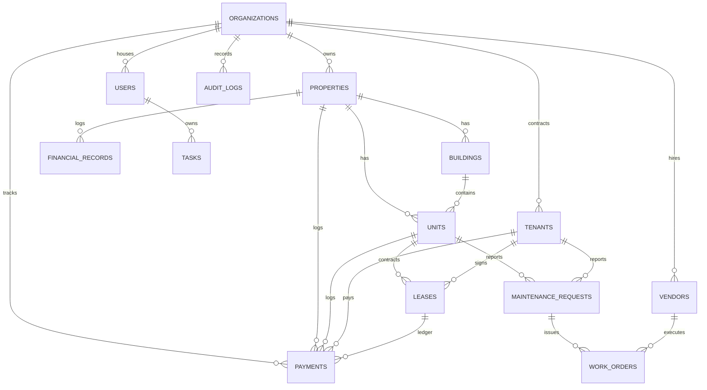

# Odyssey Domain Model

Odyssey enforces a multi-tenant relational schema. Every entity belongs to an `organization`. Archival is used instead of hard-deletes, and modifications trigger immutable history logging.

## Relational Diagram

## Core Entities

1. **organizations**: Represents the top-level landlord management company.
2. **users**: Admin accounts inside organizations. Roles include: `owner`, `manager`, `maintenance`, `read_only`.
3. **properties**: Asset location containing Nickname, Type, Ownership %, and acquisition date.
4. **buildings**: Mapped subdivision groups under multi-family properties.
5. **units**: Individual rental slots containing numbers, monthly rent, size, and status (`occupied`, `vacant`, `notice_given`, `offline`).
6. **tenants**: Renter contact card.
7. **leases**: Legal parameter mappings linking Units and Tenants. Includes Warning logic when entering the 90-day expiry window.
8. **payments**: Rent ledger tracking amount due, amount received, status (`upcoming`, `paid`, `partial`, `overdue`, `waived`), and method.
9. **maintenance_requests**: Ticket filing for unit issues (available internally).
10. **vendors**: Third-party service providers.
11. **work_orders**: Work instructions linking a maintenance request to a vendor.
12. **tasks**: Checklist items (available internally).
13. **financial_records**: Operational ledgers logging operating expenses under 10 categories.
14. **audit_logs**: Immutable JSON logs detailing CRUD changes.

## Deletion & Archiving Policy

No business records are hard deleted. Hard deletes corrupt financial and tenancy history metrics. All models contain `archived_at` timestamps. Queries filter out records where `archived_at IS NOT NULL`.

## Audit Log Policy

The `audit_logs` table is completely immutable (no update or soft-delete allowed). When any domain-service performs mutations, a log is written containing `action`, `previous_state`, and `new_state` to review transition trends.
